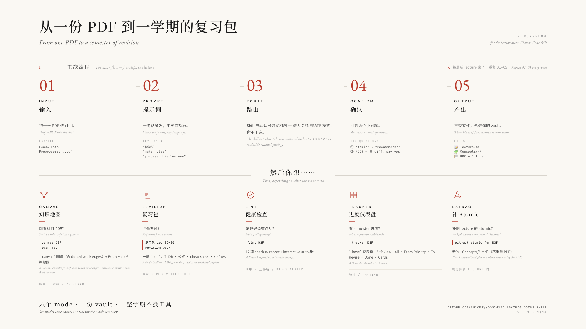

# Obsidian Lecture Notes Skill



> **从一份 PDF 到一学期的复习包** · *From one PDF to a semester of revision*

A [Claude Code skill](https://docs.claude.com/en/docs/claude-code/overview) that turns raw lecture material (PDFs, slide decks, screenshots, or pasted text) into structured Obsidian notes — with Mermaid diagrams, wikilinks for Graph View, YAML frontmatter, flashcards, and a cheat sheet. Built for university students who use Claude + Obsidian as their study stack.

一个 [Claude Code skill](https://docs.claude.com/en/docs/claude-code/overview)，把生 lecture 材料（PDF / PPT / 截图 / 纯文字）转成结构化 Obsidian 笔记 —— 内含 Mermaid 图、Graph View 用的 wikilink、YAML frontmatter、闪卡、cheat sheet。为把 Claude + Obsidian 当作学习工具的大学生设计。

**Jump to / 直达**：[中文简介](#中文简介) · [Why this exists](#why-this-exists) · [Installation](#installation) · [Modes table](#all-available-modes-v13) · [Workflow](docs/workflow.md)

📁 **See [`examples/`](examples/) for sample outputs · [`docs/`](docs/) for workflow & design rationale · [`CHANGELOG.md`](CHANGELOG.md) for version history.**
📁 **样例见 [`examples/`](examples/) · 工作流与设计依据见 [`docs/`](docs/) · 版本历史见 [`CHANGELOG.md`](CHANGELOG.md)。**

---

## 中文简介

### 这是什么

把大学课件（PDF / PPT / 讲义截图）一键转成 **复习导向** 的 Obsidian 笔记的 Claude Code skill。不是「把 slides 粘到 Obsidian」的那种自动化，而是会自动做以下事：

- 按概念拆成 **6 块结构**：plain-English intro → 自动选型的 Mermaid 图 → 紧凑 table → 记忆钩 → 考点 bullets → worked example
- 自动按概念类型选 **最合适的 diagram**（公式题选 flowchart、流派比较选 mindmap、流程类选 sequence/state，等等——15+ 种 diagram 决策表）
- 大量打 `[[wikilink]]`——Graph View 里出现次数多的概念**自动变大**，就是免费的「考点预测」
- YAML frontmatter 完整，**Obsidian Bases / Dataview 直接能查**
- 末尾自带 **闪卡 + cheat sheet + self-test**

### 六个 mode 一句话讲完

| Mode | 一句话 | 触发词 |
|---|---|---|
| **GENERATE** | 丢 PDF → 拿到一份完整 lecture 笔记 | 丢文件 / "做笔记" / "make notes" |
| **LINT** | 12 项 health check + 一键 fix | "lint DSF" / "检查我的笔记" |
| **CANVAS** | 整个科目的知识图谱（含 Exam Map 拖拽变体） | "canvas DSF" / "exam map" |
| **REVISION** | 多个 lecture 合成一份考前复习包 | "复习包 Lec 03-06" / "revision pack" |
| **TRACKER** | Obsidian Bases 数据库视图，看 semester 进度 | "tracker DSF" / "进度表" |
| **EXTRACT-ATOMIC** | 给旧 lecture 补 atomic 概念卡，不重跑 PDF | "extract atomic" / "补 atomic" |

### 完整工作流看顶图

顶部那张图就是从「丢 PDF」到「考前复习」的完整路径——5 步主线 + 5 个分支。中英对照。

### 5 分钟上手

1. 装 [Claude Code](https://docs.claude.com/en/docs/claude-code/overview) 和 [Obsidian](https://obsidian.md)
2. `git clone` 这个 repo 到 `~/.claude/skills/lecture-notes/`（见 [Installation](#installation)）
3. 在 Claude Code 里丢一份 lecture PDF + 说「做笔记」
4. 跟着 skill 的两个 confirm 问题答完，笔记落进 vault
5. 装 [Advanced Canvas](https://github.com/Developer-Mike/obsidian-advanced-canvas) 和 [Bases](https://help.obsidian.md/bases)（Obsidian 1.9+ 内置）插件，体验完整

### 为什么 worth 装

- **跨学科通用**——CS / 文科 / 医学 / 法律都能用，触发的是「内容类型」规则，不是「科目」规则
- **opt-in 不污染 vault**——atomic 概念卡不会自动生成 500 个 stub，每次问你要哪些
- **MOC 自动加行**——生成 lecture 后会主动问你要不要把这一行加进 `{SUBJECT} - MOC.md`，给你看 diff preview
- **支持中英文 trigger**——「做笔记」「复习包」「检查」都能触发对应 mode

---

## Why this exists

University lectures arrive as PDFs and slide decks. Most note workflows fall into one of two failure modes —

1. **Paste slides into Obsidian** — fast, but useless for revision. No structure, no recall practice, no exam preparation.
2. **Manually restructure each lecture** — produces good notes, but takes hours per chapter.

This skill automates the second approach. Upload a lecture → get back an Obsidian-ready `.md` with:

- A consistent 6-block per-concept template (intro → diagram → table → memory hook → exam bullets → worked example)
- A diagram type picked from a decision table based on the actual concept type (not a default)
- Aggressive `[[wikilinks]]` so Obsidian Graph View becomes useful — recurring concepts become visually larger nodes (a free heuristic for "exam-likely")
- YAML frontmatter that feeds Obsidian Properties and Dataview queries
- A flashcard bank, mini cheat sheet, and self-test at the end

## Features

- **Subject-agnostic.** Detects subject from filename, course code, or content. Works for any university subject across any semester (CS, sciences, humanities, medicine, law) — not hardcoded to one curriculum.
- **15+ diagram types** mapped to concept types: `classDiagram`, `sequenceDiagram`, `stateDiagram-v2`, `flowchart`, `mindmap`, `erDiagram`, `gantt`, and more.
- **Content-type aware conventions** — rules trigger on what the content *is* (formulas, algorithms, taxonomies, timelines, schools of thought, case studies, cause-and-effect chains) rather than what the subject is named. Works for psychology, history, medicine, law as well as CS.
- **Strict YAML self-check** before delivery — prevents the common one-line-jam bug that breaks Obsidian Properties.
- **Anti-import rule** — when given a sample note from a different subject as a style reference, copies structure only, not diagrams or content. Stops cross-subject pollution.
- **Graph View optimization** — 8-20 wikilinks per note minimum, MOC backlinks, prev/next chaining between lectures.
- **Universal MOC template** with Dataview queries that auto-populate across subjects — one template works for every subject, no manual list maintenance.
- **Atomic concept notes (on-demand)** — after generating a lecture note, the skill offers to extract individual concept files for cross-lecture linking and Canvas use. Opt-in per lecture, no auto-pollution.
- **Six pluggable modes** — `generate` (lecture → note), `lint` (audit + interactive auto-fix), `canvas` (knowledge map or exam map), `revision` (multi-lecture exam pack), `tracker` (Obsidian Bases database view), `extract-atomic` (backfill atomic concepts from past lectures).
- **Bases-ready** — every YAML field (`subject`, `lecture`, `exam_weight`, `status`, etc.) is selected to power Obsidian 1.9+ Bases queries out of the box. A universal `subject-tracker-template.base` is included.
- **CSS snippet** — optional pill styling for `#level/1` / `#level/2` / `#level/3` (and `#一级` / `#二级` / `#三级`) concept tags. Install once, all concept notes get the visual hierarchy.

## Requirements

- [Claude Code](https://docs.claude.com/en/docs/claude-code/overview) installed
- [Obsidian](https://obsidian.md) for using the notes
- *Optional:* [Dataview plugin](https://github.com/blacksmithgu/obsidian-dataview) for auto-generated MOC pages

## Installation

Clone or copy this repo's skill folder into your Claude Code skills directory:

```bash
git clone https://github.com/huichiy/obsidian-lecture-notes-skill.git
mkdir -p ~/.claude/skills
cp -R obsidian-lecture-notes-skill ~/.claude/skills/lecture-notes
```

Or symlink the cloned repo if you want git updates to flow through automatically:

```bash
ln -s "$(pwd)/obsidian-lecture-notes-skill" ~/.claude/skills/lecture-notes
```

Claude Code auto-discovers skills under `~/.claude/skills/`. No restart needed — the next chat will pick it up.

To verify: ask Claude Code "list skills" or upload a lecture file and it should auto-trigger.

## Usage

In Claude Code, drop a lecture file (PDF, PPTX, screenshots, or pasted text) into the chat → the skill auto-triggers from the context.

If it doesn't auto-trigger, just say:

> Use the lecture-notes skill on this lecture.

The output is a single `.md` file dropped into your Obsidian vault. After delivery, the skill offers to extract atomic concept notes — say which ones (or `all` / `no`) to opt in per lecture.

### All available modes (v1.3)

| Mode | Trigger phrases | What it does |
|---|---|---|
| **GENERATE** | Upload a lecture, "process this", "make notes from this" | Convert lecture material → structured Obsidian note. Default mode when a file is attached. |
| **LINT** | "lint my notes", "check OOAD notes", "audit", "rate my vault", "检查", "审一下" | Run 12 health checks → markdown report → offer interactive auto-fix for safe issues. |
| **CANVAS** (Knowledge Map) | "canvas for DSF", "knowledge graph", "concept map", "知识图谱" | Emit a `.canvas` file: MOC + every lecture + every atomic concept, hierarchical. |
| **CANVAS** (Exam Map) | "exam canvas", "exam map", "revision map", "考前 canvas" | Same generator, filtered to `exam_weight: high` only, with built-in **Confident / Weak / Notes** zones for revision. |
| **REVISION** | "exam pack for OOAD Lec 3-7", "revision pack", "复习包" | Consolidate multiple lectures into one revision document (TLDRs, formulas, flashcards, self-test). |
| **TRACKER** | "tracker for DSF", "make a tracker", "进度表", "dashboard" | Generate an Obsidian Bases (`.base`) file with 5 views: all lectures / exam priority / still to revise / done / cards. |
| **EXTRACT-ATOMIC** | "extract atomic for OOAD", "backfill atomic notes", "补 atomic" | Scan existing lecture notes and create atomic concept notes retroactively — no PDF re-processing. |

All modes are subject-agnostic: name your subject (OOAD, DSF, STAT, PSY, HIST, MED…) and the skill adapts.

### Recommended vault structure

```
Vault/
├── [SUBJECT-CODE] - MOC.md           ← parent / Map of Content page
├── [SUBJECT-CODE] Lec 01 — Topic.md
├── [SUBJECT-CODE] Lec 02 — Topic.md
└── ...
```

A MOC (Map of Content) template is included in `templates/`. See the next section to set one up per subject.

### Set up a subject MOC (one-time per subject)

The repo includes a universal `templates/subject-MOC-template.md` that uses [Dataview](https://github.com/blacksmithgu/obsidian-dataview) queries to auto-populate as you add lecture notes. **One template works for every subject** — no need to duplicate logic per course.

1. Copy `subject-MOC-template.md` into your vault
2. Rename it to match your subject — e.g., `OOAD - MOC.md`, `DSF - MOC.md`. This exact format matters because every lecture note's footer links to `[[SUBJECT-CODE - MOC]]`.
3. Open the file, change `subject: SUBJECT_CODE` in the YAML to your actual subject code (e.g., `subject: OOAD`)
4. Replace `[Subject Full Name]` in the H1 heading
5. Save

From then on, every lecture note you save with matching `subject:` YAML automatically appears in the MOC. The template includes:

- **Auto-listed lectures table** (sorted by lecture number, with topic, exam weight, and status columns)
- **Exam-priority filter** — shows only lectures flagged `exam_weight: high`
- **Revision status tracker** — groups lectures by `draft` / `reviewed` / `complete`
- **Concept frequency view** — counts how often each `[[wikilink]]` appears across the subject's lectures. Concepts mentioned in 5+ lectures are almost certainly exam-important — this is the data equivalent of what Graph View shows visually.

If you don't use Dataview, the template still works as a manual hub page — just edit the lecture list by hand.

## Changelog

**v1.3 (current) — feature-complete milestone**
- **MOC auto-update in GENERATE** — after saving a lecture, the skill locates `{SUBJECT} - MOC.md`, plans an insertion in lecture-number order, shows a unified-diff preview, writes only after explicit `yes`. Skips MOCs with complex layouts to avoid stomping curated sections.
- **Atomic note worked-example boost** — atomic concept notes now include block 6 (worked example) in addition to intro + diagram + key points. Usable for cross-lecture revision standalone.
- **Style Settings variable expansion** — `styles/concept-levels.css` exposes text color, vertical padding, font size/weight, letter spacing, border (width/style/color), drop shadow, uppercase toggle — all tweakable from the Style Settings plugin UI.
- Closes the planned v1.3 feature-complete checklist. Beyond this the skill enters maintenance mode.

**v1.2.1**
- Dotted weak edges in Canvas via Advanced Canvas (`styleAttributes.path = "dotted"`).
- Bases tracker template syntax fix (drop `file.` prefix from YAML property references).

**v1.2**
- New mode: **TRACKER** — generate `.base` database view from universal template, AI auto-detects subject.
- New mode: **EXTRACT-ATOMIC** — backfill atomic concept notes from already-generated lecture notes without re-processing PDFs.
- **CANVAS** gains the Exam Map variant — filters to `exam_weight: high` only and adds Confident / Weak / Notes annotation zones.
- **LINT** gains interactive auto-fix — `all` / `safe-only` / pick-by-number, with preview diffs before applying.
- New CSS snippet `styles/concept-levels.css` for `#level/1` / `#level/2` / `#level/3` pill styling (Style Settings compatible).
- New template `templates/subject-tracker-template.base`.
- README expanded with mode reference table, plugin recommendations, and CSS install instructions.

**v1.1**
- Restructure to router + modes pattern. SKILL.md becomes a dispatcher.
- New modes (implementations, not stubs): LINT, CANVAS (Knowledge Map only), REVISION.
- Content-type conventions replace subject-keyed domain rules — works for humanities, medicine, history, etc.
- Opt-in atomic concept note extraction at the end of GENERATE.
- Switch from `.skill` bundle format to Claude Code folder format.
- v1.1 fixes from first end-to-end test: revision-mode formula filter, canvas pre-flight confirmation, generate-mode parent-link rule.

**v1.0**
- Initial single-file `lecture-notes.skill` for claude.ai upload.

## Customization

This skill is designed to be forked. All rules live in `modes/generate.md`. Common customizations:

### Add a new content-type rule

Rules are keyed off **what the content is** (formulas, algorithms, timelines, schools of thought, case studies, etc.) rather than what subject the lecture belongs to. Open `modes/generate.md` → find `## Content-type conventions` → add your trigger and rule block following the same pattern. Examples already cover: formulas, algorithms, code, taxonomies, timelines, school comparisons, people contributions, cause-and-effect, case studies, definitions, processes, UML.

### Change the per-concept template

The default 6 blocks are: plain-English intro, diagram, compact table, memory hook, exam bullets, worked example. Edit `## Per-concept 6-block template` in `modes/generate.md` to add, remove, or reorder.

### Adjust YAML schema

Default fields: `subject`, `course_code`, `lecture`, `title`, `source`, `tags`, `aliases`, `related`, `exam_weight`, `status`. Add or remove based on what your Dataview queries need.

### Add a new mode

Create a new file under `modes/`, then add a routing row to `SKILL.md` so Claude knows when to dispatch to it.

## Recommended Obsidian plugins

The skill produces plain `.md` / `.canvas` / `.base` / `.css` files, so it works on a vanilla Obsidian install. These plugins enhance the experience:

**Must-have**
- Obsidian 1.9+ (Bases is built in; `.base` files won't render on earlier versions)

**Strongly recommended**
- [Advanced Canvas](https://github.com/Developer-Mike/obsidian-advanced-canvas) — better canvas rendering (presentations, portals, flow nodes). Used by the `.canvas` outputs. **Enables dotted lines on weak cross-reference edges** in Knowledge Maps and Exam Maps — strongly recommended.
- [Canvas Mindmap](https://github.com/quorafind/Obsidian-Canvas-MindMap) — auto-layout helper for Canvas hierarchies.
- [Optimize Canvas Connections](https://github.com/felixchenier/obsidian-optimize-canvas-connections) — keeps edges from crossing chaotically.
- [Style Settings](https://github.com/mgmeyers/obsidian-style-settings) — exposes the concept-level CSS variables (colors, pill shape) in Obsidian's settings UI. Without it, edit `concept-levels.css` directly.

**Optional**
- [Dataview](https://github.com/blacksmithgu/obsidian-dataview) — for the MOC template's auto-populated query blocks (works alongside Bases).
- [Canvas Filter](https://github.com/ikoshelev/obsidian-canvas-filter) — show/hide canvas nodes by tag or color (useful for Exam Maps).
- [Collapse Node](https://github.com/zachatoo/obsidian-canvas-collapse-node) — collapse canvas cards to title-only.

**Skip**
- Excalidraw, multiple "Send to back" / "Enhanced" canvas plugins, Zettelflow, Link Exploder — they overlap with built-in features or with each other.

## How it works

A Claude Skill is a folder containing a `SKILL.md` with YAML frontmatter (`name`, `description`) and markdown instructions. Claude Code reads the description at the start of every session — when a user's input matches what the description claims to handle, the body of the skill loads into context and Claude follows its instructions.

This skill uses a **router + modes** pattern. `SKILL.md` is a small dispatcher that detects which mode the user wants (generate / lint / canvas / revision / tracker / extract-atomic) and then reads the corresponding file under `modes/`. Each mode file is a self-contained instruction set — so Claude only loads the rules relevant to the current request, and modes can be edited independently without affecting each other.

See `modes/generate.md` for the GENERATE rules; the other mode files document their own behavior in the same format.

## Project structure

```
obsidian-lecture-notes-skill/
├── SKILL.md                              ← router (mode detection)
├── modes/
│   ├── generate.md                       ← lecture material → Obsidian note
│   ├── lint.md                           ← health-check + interactive auto-fix
│   ├── canvas.md                         ← Knowledge Map + Exam Map variants
│   ├── revision.md                       ← multi-lecture exam pack
│   ├── tracker.md                        ← Obsidian Bases database view
│   └── extract-atomic.md                 ← backfill atomic concepts
├── templates/
│   ├── subject-MOC-template.md           ← curated landing page
│   └── subject-tracker-template.base     ← database view (used by tracker mode)
├── styles/
│   └── concept-levels.css                ← pill styling for #level/1/2/3 tags
├── examples/
│   ├── sample-lecture-note.md            ← real GENERATE output (EDA lecture)
│   ├── sample-atomic-concept.md          ← real atomic note (Box Plot)
│   └── sample-canvas.canvas              ← Exam Map structure illustrated
├── docs/
│   ├── workflow.md                       ← 5-stage study cycle, mode usage
│   ├── design-rationale.md               ← why router + modes, why content-type rules, etc.
│   └── roadmap.md                        ← v1.3 planning + out-of-scope items
├── CHANGELOG.md
├── LICENSE
└── README.md
```

## Install the CSS snippet (optional)

```bash
cp styles/concept-levels.css "/path/to/YourVault/.obsidian/snippets/concept-levels.css"
```

Then in Obsidian: **Settings → Appearance → CSS snippets** → toggle `concept-levels` ON. If you have the **Style Settings** plugin, you can also tweak the pill colors from the UI.

## Known limitations

- **Triggering is occasionally inconsistent.** If Claude responds without using the skill, say *"use the lecture-notes skill"* explicitly.
- **Mermaid syntax sometimes has subtle errors.** Verify diagrams render correctly by previewing in Obsidian before relying on them.
- **Large lectures (50+ slides) may need two passes** — process first half → second half → ask for a merged cheat sheet.
- **Subject detection can mis-fire** on lectures with no filename, course code, or title slide. Provide subject context when needed.
- **This release targets Claude Code.** The folder format works directly in Claude Code's skills directory. If you need a claude.ai-uploadable bundle (`.skill` file), you'll need to package it yourself — that workflow isn't included in this repo.
- **Tracker mode requires Obsidian 1.9+.** Bases (`.base` files) won't render on older versions; the tracker mode pre-flight check warns about this.
- **Auto-fix in Lint mode is opt-in per run.** Risky fixes (vault-wide renames) always show a preview diff before applying — there is no "silent fix" path.

## Contributing

Issues and PRs welcome. If you fork this for your own subjects, feel free to share — the skill is built to be personalized.

## Credits

- Built on [Anthropic's Claude Skills](https://docs.claude.com)
- Diagrams via [Mermaid](https://mermaid.js.org)
- Inspired by [Nick Milo's PKM principles](https://www.linkingyourthinking.com) (Maps of Content, atomic notes)

## License

MIT
