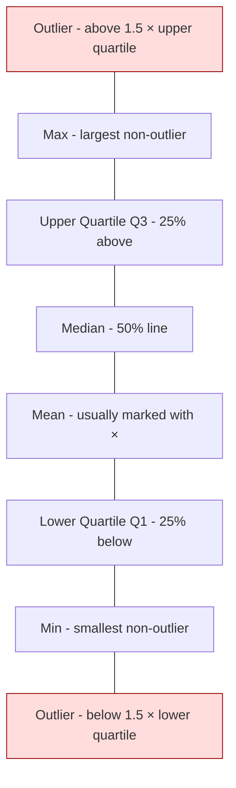

# Box Plot

A box plot is a **5-number visual summary** of a dataset — minimum, Q1, median, Q3, maximum — with **outliers** plotted as separate dots beyond the whiskers. One glance gives you centre, spread, skew, and extremes; it is the densest information-per-pixel chart in [[Exploratory Data Analysis]].

## Anatomy

## Key rules

- The **box** = [[IQR]] (Q3 − Q1), the middle 50% of data.
- A dot is an **[[Outliers|outlier]]** if it sits beyond **Q3 + 1.5·IQR** or **Q1 − 1.5·IQR**.
- Mean (×) vs median line → unequal ⇒ [[Skewness|skew]].
- Best for **comparing groups side-by-side**.

## Mentioned in

- [[DSF Lec 04 — Exploratory Data Analysis]]

## Related concepts

- [[IQR]]
- [[Outliers]]
- [[Skewness]]
- [[Measures of Dispersion]]
- [[Histogram]]
