# DSF Lec 04 — Exploratory Data Analysis (EDA)

> [!note] 5-second TLDR
> EDA = the **first look** at data using **summary stats + visualisations** to spot patterns, anomalies, and shape. You can't model what you don't understand — and "is it normal?" decides every downstream choice.

> [!info] Lecture Map
> **Course:** CDS6214 · **Lecture:** 04 · **Source:** `Lec04 EDA.pdf`
> **Prereq:** [[DSF Lec 03 — Data Preprocessing]] (clean data first) · **Next:** [[DSF Lec 05 — Data Mining]]
> **Related notes:** [[Descriptive Statistics]] · [[Normal Distribution]] · [[Box Plot]] · [[Correlation Coefficient]] · [[Outliers]]

## 🗺️ Lecture mindmap

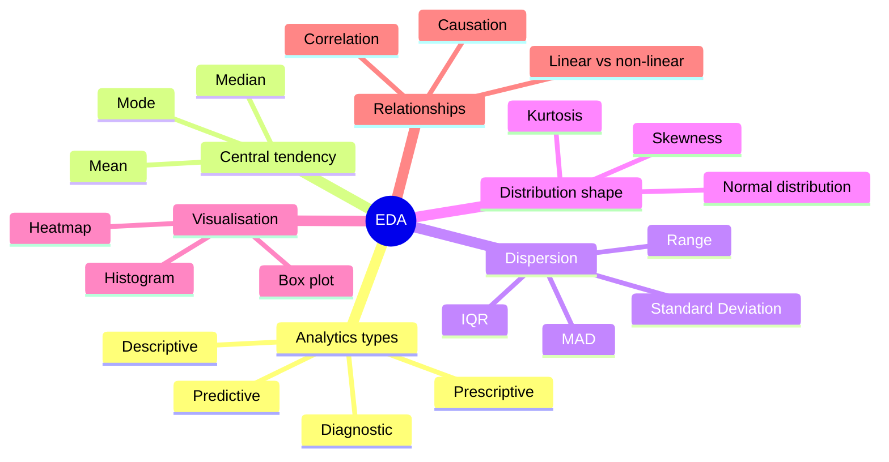

## 📑 Table of contents

- [[#🧩 EDA — what it is and why it matters|EDA — what it is and why it matters]]
- [[#🧩 The 5 Pillars of Modern EDA|The 5 Pillars of Modern EDA]]
- [[#🧩 Dimensionality Univariate / Bivariate / Multivariate|Dimensionality]]
- [[#🧩 The 4 Types of Analytics|The 4 Types of Analytics]]
- [[#🧩 Measures of Central Tendency|Measures of Central Tendency]]
- [[#🧩 Measures of Dispersion|Measures of Dispersion]]
- [[#🧩 Box Plot|Box Plot]]
- [[#🧩 Histogram and Normal Distribution|Histogram & Normal Distribution]]
- [[#🧩 Skewness|Skewness]]
- [[#🧩 Kurtosis|Kurtosis]]
- [[#🧩 Relationships Between Variables|Relationships Between Variables]]
- [[#🧩 Correlation Analysis|Correlation Analysis]]

---

## 🧩 EDA — what it is and why it matters
`#concept/eda` `#exam-likely`

1. **Plain-English intro.** Before you build any model, you need to *look* at the data. EDA is that look — using summary numbers (mean, std, IQR) and pictures (box plots, histograms, heatmaps) to find patterns, spot anomalies, and check assumptions. Skip EDA → you'll fit a model on garbage and not know it.

2. **Diagram — where EDA sits in the pipeline.**

3. **Compact table.**

| Aspect | What EDA does | Why it matters |
|---|---|---|
| Summary stats | Mean, std, box plots | Quantify centre + spread |
| Visualisations | Histograms, scatter, lag plots | Eye spots patterns no algorithm can |
| Hypotheses | Generate them for formal testing | Cheap insurance against bad models |
| Quality | Ensure data is clean enough to model | Skipping → wrong conclusions |

4. **Memory hook.** **EDA = "look before you leap."** No EDA → garbage in, garbage out.

5. **Exam bullets.**
   - EDA = initial investigation of a dataset to understand main characteristics.
   - Uses **statistics** + **visualisations**.
   - Goals: find patterns, spot anomalies, check assumptions, generate hypotheses.
   - Tools: summary stats (mean, SD, box plot), graphical methods (histogram, scatter, lag plot).
   - **Skipping EDA → poor models + incorrect conclusions.**

6. **Worked example.** You receive a sales dataset with 50k rows. Before fitting regression: run `df.describe()` (central tendency + dispersion) → plot histogram of `sales` (is it normal? skewed?) → scatter `sales` vs `temperature` (linear? curve?) → heatmap all features. *Now* you know which model fits and which features to engineer.

---

## 🧩 The 5 Pillars of Modern EDA
`#concept/5-pillars-eda` `#pattern`

1. **Plain-English intro.** EDA isn't random poking — it's a structured 5-step approach that ensures you check everything important before modelling. Three guiding principles + five concrete steps.

2. **Diagram — process flow.**

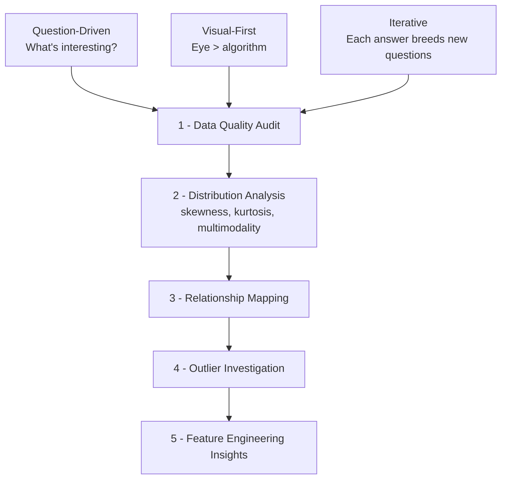

3. **Compact table — the 5 steps.**

| # | Pillar | What you check | Gold rule |
|---|---|---|---|
| 1 | Data Quality Audit | Missing, duplicates, types | Trust no column blindly |
| 2 | Distribution Analysis | Skew, kurtosis, modes | **If it's not normal, don't treat it as normal** |
| 3 | Relationship Mapping | Correlations, interactions | Visualise pairs before computing r |
| 4 | Outlier Investigation | Extremes + their causes | Outlier ≠ error; investigate |
| 5 | Feature Engineering Insights | Useful transforms revealed by 1–4 | EDA *informs* features, not the other way |

4. **Memory hook.** **"Q-V-I" principles, then "QDROF" steps**:
   - Q = Question-driven · V = Visual-first · I = Iterative
   - **Q**uality → **D**istribution → **R**elationships → **O**utliers → **F**eatures

5. **Exam bullets.**
   - 3 principles: Question-Driven, Visual-First, Iterative.
   - 5 steps in order: Data Quality Audit → Distribution Analysis → Relationship Mapping → Outlier Investigation → Feature Engineering Insights.
   - **Gold Rule:** "If it's not normal, don't treat it as normal" — sits inside Distribution Analysis.

6. **Worked example.** Pillar 2 on `house_prices`: histogram shows right-skew (long tail of expensive homes). Gold Rule fires → don't use mean-based methods (linear regression assumes normal residuals). Instead: log-transform `price`, *then* model. Without Pillar 2 → silently violates regression assumption.

---

## 🧩 Dimensionality Univariate / Bivariate / Multivariate
`#concept/dimensionality`

1. **Plain-English intro.** Each column in your dataset is a **dimension** (a feature/variable). EDA is named by how many dimensions you look at *at once*. Looking at one column is **univariate**; two together is **bivariate**; three or more is **multivariate**. With many dimensions, you hit the **curse of dimensionality** — data points spread thin in high-D space.

2. **Diagram.**

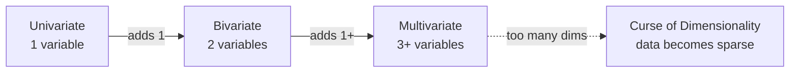

3. **Compact table — analysis vs techniques.**

| Type | What you study | Non-graphical | Graphical |
|---|---|---|---|
| Univariate | One variable's shape | Mean, median, SD, frequency table | Histogram, box plot, density plot, bar chart |
| Bivariate | Two-variable relationship | Covariance, Pearson, Spearman, cross-tab | Scatter plot, heatmap, grouped bar |
| Multivariate | 3+ variable interactions | Same + dim reduction (PCA) | Pair plot, bubble chart, heatmap |

4. **Memory hook.** **"Uni-Bi-Multi" = 1-2-many**. Univariate asks "what does this look like?"; Bivariate asks "do these two move together?"; Multivariate asks "what's the joint behaviour?"

5. **Exam bullets.**
   - **Dimensionality** = number of features/variables.
   - **Univariate** = 1 variable; **Bivariate** = 2 variables (relationship); **Multivariate** = 3+ variables (complex interactions).
   - **Curse of dimensionality:** volume of data space grows exponentially with each added dim → points become sparse and hard to analyse.
   - Techniques differ per type (see table).

6. **Worked example.** `iris` dataset, 4 features. Univariate: histogram of `petal_length`. Bivariate: scatter `petal_length` vs `petal_width`. Multivariate: pair plot of all 4 features colour-coded by species — reveals which features separate species best.

---

## 🧩 The 4 Types of Analytics
`#concept/analytics-types` `#exam-likely`

1. **Plain-English intro.** Analytics progresses through 4 levels of complexity, each answering a different question about the data — from "what happened" all the way to "what should we do." Knowing which level a tool sits at tells you what kind of value it gives you.

2. **Diagram — progression of complexity & value.**

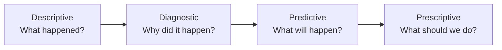

3. **Compact table — the 4 types side-by-side.**

| Type | Key question | Time focus | Purpose | Typical techniques |
|---|---|---|---|---|
| **Descriptive** | What happened? | Past | Summarise past data | Aggregation, dashboards, summary stats, charts |
| **Diagnostic** | Why did it happen? | Past | Find root causes | Drill-down, correlation, data mining, probability |
| **Predictive** | What will happen? | Future | Forecast outcomes | Regression, time series, neural nets, ML |
| **Prescriptive** | What should we do? | Future | Recommend optimal action | Optimisation, simulation, business rules, ML |

4. **Memory hook.** **"D-D-P-P" → "Past-Past-Future-Future"**. Or read across in 4 questions: **"What → Why → What will → What should."** Each step *up* the ladder is more complex but more valuable.

5. **Exam bullets.**
   - 4 types in order: **Descriptive, Diagnostic, Predictive, Prescriptive.**
   - First two are about the **past**; last two about the **future**.
   - Each answers a different question (What / Why / Will / Should).
   - **Complexity and value both increase** as you climb.
   - EDA primarily supports **Descriptive + Diagnostic** levels.

6. **Worked example.** A retailer:
   - **Descriptive:** monthly sales = $1.2M, down 3% from last month.
   - **Diagnostic:** drill-down → one region dropped 18% during a competitor's promo.
   - **Predictive:** time-series forecasts next month's sales = $1.15M ± 50k.
   - **Prescriptive:** optimisation suggests a 10% promo in that region → expected lift of $120k.

---

## 🧩 Measures of Central Tendency
`#concept/central-tendency` `#exam-likely` `#formula`

1. **Plain-English intro.** A single number that represents the "typical value" of a dataset. Three choices — mean, median, mode — each best for different data shapes. Mean is most common but breaks on outliers; median is the robust workhorse; mode is the only one for categories.

2. **Diagram — decision tree.**

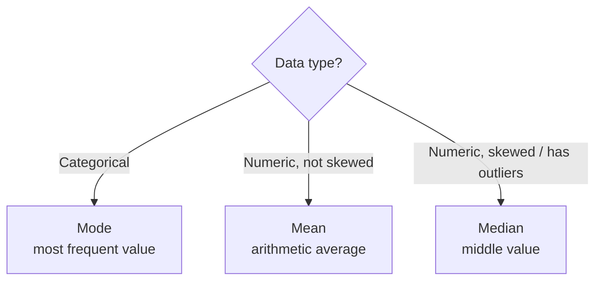

3. **Compact table — the three measures.**

| Measure | Definition | Formula | Best for | Watch out |
|---|---|---|---|---|
| **Mean** | Sum / count | $\bar{x} = \frac{\sum x_i}{N}$ | Continuous, symmetric | **Pulled by outliers** |
| **Median** | Middle value (ordered) | — (50th percentile) | Skewed, outlier-heavy | Ignores magnitude |
| **Mode** | Most frequent value | — (highest frequency) | **Categorical** (nominal) | Can be multimodal or absent |

**Variable legend:** $x_i$ = each value, $N$ = number of values, $\bar{x}$ = mean.

4. **Memory hook.** **"Mean is fragile, median is steady, mode is the only friend categorical data has."**

5. **Exam bullets.**
   - 3 measures: mean, median, mode.
   - **Mean** is most common for continuous interval/ratio data **that is not heavily skewed**.
   - **Median** is best for **skewed data or data with outliers** — it's the middle value, unaffected by extremes.
   - **Mode** is the value occurring most frequently — **the only measure applicable to categorical (nominal) data**.
   - Outliers pull the **mean** but not the median.

6. **Worked example — outliers wreck the mean.**

| Dataset | Values | Mean |
|---|---|---|
| A | 10, 12, 11, 13, 12 | **11.6** |
| B | 10, 12, 11, 13, **100** | **29.2** |

One extreme value (100) jumped the mean from 11.6 to 29.2 — but the **median for both is 12**. Median wins on robustness.

Activity from slides: `Data = [65, 55, 89, 56, 35, 14, 56, 55, 87, 45, 92]` →
- Sort: 14, 35, 45, 55, 55, 56, 56, 65, 87, 89, 92
- Mean = (14+35+45+55+55+56+56+65+87+89+92) / 11 = 649 / 11 ≈ **59.0**
- Median (middle of 11) = **56** (6th value)
- Mode = **55 and 56** tied (each appears twice) → bimodal

---

## 🧩 Measures of Dispersion
`#concept/dispersion` `#exam-likely` `#formula`

1. **Plain-English intro.** Central tendency tells you *where* the data sits; dispersion tells you *how spread out* it is. Two datasets can have the same mean but wildly different stories — one tight, one all over the place. The 4 main measures trade off simplicity vs robustness to outliers.

2. **Diagram — when to use which.**

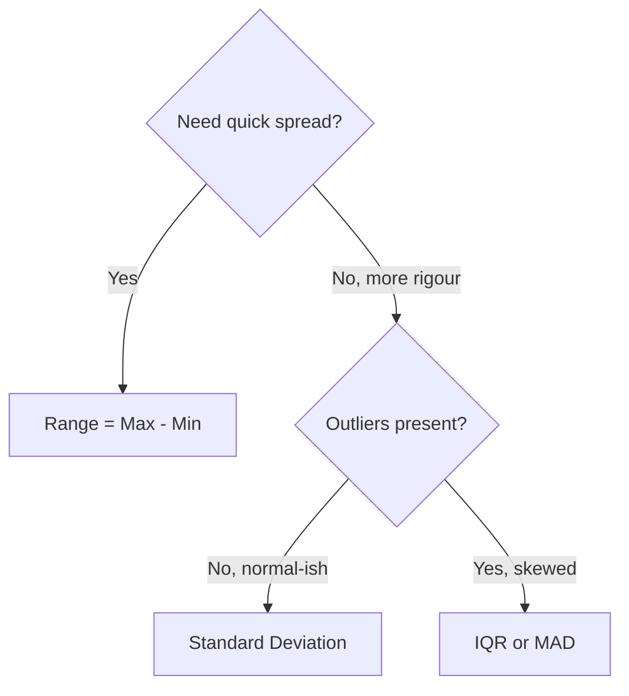

3. **Compact comparison table — all 4 measures.**

| Measure | Definition | Formula | Sensitive to outliers? | Units | Best for |
|---|---|---|---|---|---|
| **Range** | Max − Min | $R = x_{max} - x_{min}$ | **Yes (very)** | Same | Quick spread check |
| **Variance** | Mean squared deviation | $\sigma^2 = \frac{\sum (x_i - \bar{x})^2}{N}$ | Yes | **Squared** | Theoretical basis |
| **Standard Deviation** | √variance | $\sigma = \sqrt{\frac{\sum (x_i - \bar{x})^2}{N}}$ | Yes | Same | Normal-ish data, general use |
| **IQR** | Q3 − Q1 | $IQR = Q_3 - Q_1$ | **No** | Same | Skewed / outlier-heavy data |
| **MAD** | Mean of \|deviations\| | $MAD = \frac{\sum \lvert x_i - \bar{x}\rvert}{N}$ | **Less so** | Same | Simple, robust, forecasting |

**Variable legend:** $x_i$ = each value, $\bar{x}$ = mean, $N$ = count, $Q_1, Q_3$ = 1st and 3rd quartiles.

4. **Memory hook.** **"Squared (variance) → Same units (SD) → Skip the tails (IQR) → Absolute deviations (MAD)."** SD for normal data, IQR for skewed.

5. **Exam bullets.**
   - **Range** = max − min: simple but **very sensitive to outliers**, no info on distribution shape.
   - **Standard Deviation** = avg distance from mean, **same units as data**. Sensitive to outliers but most widely used.
   - **IQR** = Q3 − Q1, captures **middle 50%**, **robust to outliers**. Used in box plots.
   - **MAD** = average absolute deviation from mean. Less sensitive than SD/variance. Common in forecasting / retail.
   - **Variance** = SD² → squared units (harder to interpret directly).
   - Real-world: **Finance → Variance** (risk), **Education → SD** (consistency), **Real estate → IQR** (no luxury bias), **Retail → MAD** (forecasts).

6. **Worked example — same dataset, 4 numbers.**
   Dataset: `[2, 4, 6]`, mean = 4.
   - Range = 6 − 2 = **4**
   - Variance = ((2−4)² + (4−4)² + (6−4)²) / 3 = (4 + 0 + 4) / 3 ≈ **2.67**
   - SD = √2.67 ≈ **1.63**
   - MAD = (|2−4| + |4−4| + |6−4|) / 3 = (2 + 0 + 2) / 3 ≈ **1.33**

   MAD < SD (always, by definition) — and the gap grows when outliers exist.

---

## 🧩 Box Plot
`#concept/box-plot` `#exam-likely`

1. **Plain-English intro.** A box plot is a 5-number visual summary: minimum, Q1, median, Q3, maximum, with **outliers** plotted as separate dots beyond the "whiskers." One glance gives you centre, spread, skew, and extremes — the densest information-per-pixel chart in EDA.

2. **Diagram — anatomy of a box plot.**

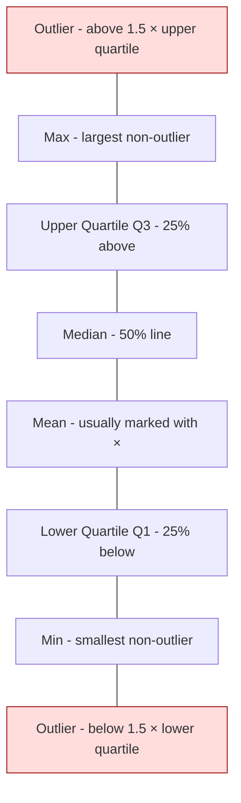

3. **Compact table — what each part tells you.**

| Part | Statistic | What it tells you |
|---|---|---|
| Box top | Q3 | 75th percentile |
| Box middle line | Median | 50th percentile (centre) |
| × mark | Mean | Average (compare to median → skew) |
| Box bottom | Q1 | 25th percentile |
| Box height | **IQR** | Spread of middle 50% |
| Whisker ends | Max / Min (non-outlier) | Range excluding extremes |
| Dots beyond | **Outliers** | > Q3 + 1.5·IQR or < Q1 − 1.5·IQR |

4. **Memory hook.** **"5-number summary in a box."** Mean ≠ median → **skew**. Big box → **high spread**. Far dot → **outlier**.

5. **Exam bullets.**
   - Box plot displays **min, Q1, median, Q3, max** and **outliers** as dots.
   - Outliers defined as values **> Q3 + 1.5 × IQR** or **< Q1 − 1.5 × IQR**.
   - The box represents the **IQR** (middle 50% of data).
   - Used in [[Dispersion]] visualisation, healthcare, real estate.
   - Box plot is excellent for **comparing groups** side-by-side.

6. **Worked example — comparing 3 groups (from slide case study).**

   | Group | IQR | Spread | Outlier location |
   |---|---|---|---|
   | A | ≈ 10.07 | Moderate, balanced | Lower range |
   | B | ≈ 20.16 | **Largest** — highest values but most variable (implies risk) | Higher range |
   | C | ≈ 6.80 | **Smallest** — most consistent / reliable | Both ends |

   Reading: A is the safe average, B is high-risk high-reward, C is the most predictable.

---

## 🧩 Histogram and Normal Distribution
`#concept/histogram` `#concept/normal-distribution` `#exam-likely`

1. **Plain-English intro.** A histogram bins your data into buckets and shows how many values fall in each — revealing the **shape** of the distribution. The most famous shape is the **normal distribution**: perfectly symmetric around the mean, like a bell. Wider distributions mean larger SD; narrower means smaller SD.

2. **Diagram — three distribution shapes.**

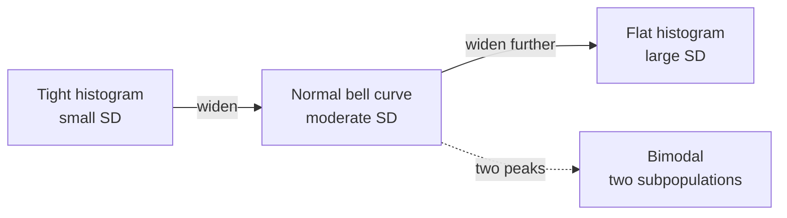

3. **Compact table — reading a histogram.**

| Observation | Tells you |
|---|---|
| Symmetric bell | Approximately normal → mean ≈ median ≈ mode |
| Long tail right | **Positive skew** → mean > median |
| Long tail left | **Negative skew** → mean < median |
| Two peaks | **Bimodal** → two subgroups in data |
| Very flat | High variance / wide spread |
| Very tall narrow peak | Low variance / **heavy peak** (high kurtosis) |

4. **Memory hook.** **"Histogram = data's silhouette."** Bell = normal. Long tail = skew. Two humps = two stories.

5. **Exam bullets.**
   - Histogram = frequency plot of binned values; shows **distribution shape**.
   - **Normal distribution** is symmetric around the mean.
   - **Wider distribution → larger SD**; narrower → smaller SD.
   - Shape decides which stats are valid: mean & SD assume **roughly normal**; median & IQR are safer for skewed.
   - Histograms also reveal **multimodality** — a clue that data contains distinct subgroups.

6. **Worked example.** Two student-score histograms, same mean = 70:
   - Class A: tight bell around 70 (SD = 5) → most students at ~70, very few far off.
   - Class B: flatter, range 40–95 (SD = 15) → mixed performance, may have two ability groups (check for bimodality).

   Same mean tells you nothing about the story. The **histogram does.**

---

## 🧩 Skewness
`#concept/skewness` `#exam-likely`

1. **Plain-English intro.** Skewness measures whether your data leans to one side. Zero = symmetric (normal). Positive (right-skewed) = long tail on the right, most data on the left, mean > median. Negative (left-skewed) = mirror image. The size of the number tells you *how strong* the lean is.

2. **Diagram — three shapes + mean/median/mode positions.**

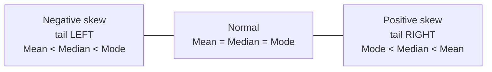

3. **Compact table — rules of thumb.**

| Skewness value | Distribution type | Interpretation |
|---|---|---|
| ≈ 0 | Symmetric | Evenly distributed |
| > 0 | Positively skewed | Right tail longer; most data left |
| < 0 | Negatively skewed | Left tail longer; most data right |
| −0.5 to 0.5 | Approximately symmetric | Treat as ~normal |
| −1 to −0.5 or 0.5 to 1 | **Moderately skewed** | Be cautious with mean-based stats |
| < −1 or > 1 | **Highly skewed** | **Don't treat as normal** — use median/IQR or transform |

4. **Memory hook.** **"Skew is named after the tail, not the hump."** Right tail = positive skew. Also: **mean chases the tail** — if mean > median, the tail is on the right.

5. **Exam bullets.**
   - **Skewness** = measure of **asymmetry** in a distribution.
   - **Positive skew** (right-skewed): tail to the right, **mean > median**.
   - **Negative skew** (left-skewed): tail to the left, **mean < median**.
   - **Zero skewness** = symmetric (e.g., normal distribution).
   - Thresholds: |skew| < 0.5 ≈ symmetric, 0.5–1 moderate, > 1 highly skewed.
   - Highly skewed → **do not treat as normal** (Gold Rule from Pillar 2).

6. **Worked example.** Income data is almost always **positively skewed**: most people earn modestly, a few earn millions (long right tail). If mean salary = $80k but median = $55k, the gap signals **right skew** — and tells you mean is misleading. Use median when reporting "typical" income.

---

## 🧩 Kurtosis
`#concept/kurtosis` `#exam-likely`

1. **Plain-English intro.** Kurtosis measures the **heaviness of the tails** compared to a normal distribution. High kurtosis = sharp peak + fat tails (more extreme values likely). Low kurtosis = flat peak + thin tails (extreme values rare). Don't confuse with skewness — kurtosis is about tail weight, not lopsidedness.

2. **Diagram — three kurtosis types.**

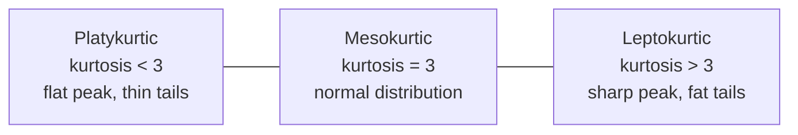

3. **Compact table.**

| Type | Kurtosis | Shape | Implication |
|---|---|---|---|
| **Mesokurtic** | = 3 | Normal-like | Standard reference |
| **Leptokurtic** | > 3 | Sharp, peaked, fat tails | **More outliers expected** |
| **Platykurtic** | < 3 | Flat, broad, thin tails | Fewer outliers |

4. **Memory hook.** **"Lepto = leaping peak. Platy = plate-flat. Meso = middle (normal)."** High kurtosis → fatter tails → **more risk of extreme values**.

5. **Exam bullets.**
   - **Kurtosis** = measure of **tail heaviness** vs normal distribution.
   - Normal distribution kurtosis = **3** (mesokurtic).
   - **High kurtosis (> 3)** = leptokurtic: sharper peak, **fatter tails → more outliers**.
   - **Low kurtosis (< 3)** = platykurtic: flatter peak, **thinner tails → fewer outliers**.
   - Skewness ≠ Kurtosis: skew = asymmetry; kurtosis = tail weight.

6. **Worked example.** Daily stock returns are usually **leptokurtic** — mostly small moves around 0 (sharp peak), but **rare massive crashes** (fat tails). A normal-distribution risk model would underestimate crash probability — this is why finance uses fat-tailed models.

---

## 🧩 Relationships Between Variables
`#concept/relationship-types`

1. **Plain-English intro.** EDA's second job (after understanding individual variables) is figuring out **how variables relate** to each other. Four key relationship types — and confusing them costs you the model.

2. **Diagram.**

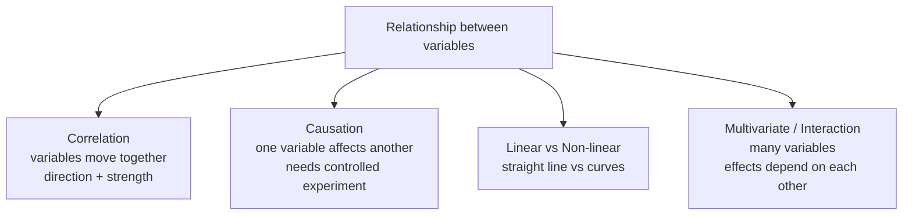

3. **Compact comparison table.**

| Type | What it means | How to detect | Watch out |
|---|---|---|---|
| **Correlation** | Variables move together (+, −, 0) | Pearson/Spearman r, scatter plot | r doesn't imply cause |
| **Causation** | One variable directly affects another | **Controlled experiment** | Hard to prove from observation alone |
| **Linear** | Straight-line relationship | Scatter + regression line | r = 0 doesn't mean "no relationship" — could be curved |
| **Non-linear** | Curve, U-shape, threshold | Scatter inspection, polynomial fit | Linear methods miss it |
| **Multivariate / Interaction** | Joint effects across 3+ variables | Pair plots, regression with interaction terms | Univariate views hide it |

4. **Memory hook.** **"Correlation is a clue, causation is a proof, non-linear hides in straight-line tests."**

5. **Exam bullets.**
   - **Correlation** = how 2 variables move together: positive, negative, or none.
   - **Causation** = one variable **directly affects** another; usually verified by **controlled experiments**.
   - **Linear** = straight-line; **non-linear** = curves / complex patterns.
   - **Multivariate** = involves many variables; **interaction** effects = variables influence each other.
   - Correlation **does not imply** causation.

6. **Worked example.** Ice cream sales and sunglasses sales are highly correlated. Does ice cream cause sunglasses? No — both are caused by **hot weather** (a confounding variable). Without identifying the confounder, you'd build a useless model.

---

## 🧩 Correlation Analysis
`#concept/correlation` `#exam-likely` `#formula`

1. **Plain-English intro.** Correlation analysis quantifies the linear relationship between two numeric variables, giving you a number **r** between −1 and +1. +1 = perfect upward line, −1 = perfect downward line, 0 = no linear pattern. Don't trust r blindly — visualise first.

2. **Diagram — correlation scale.**

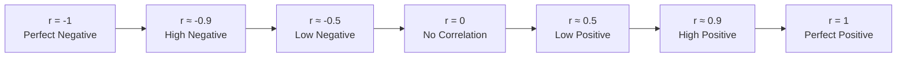

3. **Compact table — interpreting r.**

| r value | Strength | Direction | Visual hint |
|---|---|---|---|
| ±1.0 | Perfect | + or − | Points on a line |
| ±0.7 to ±0.99 | High | + or − | Tight elongated cluster |
| ±0.3 to ±0.7 | Moderate / low | + or − | Cloud with trend |
| 0 to ±0.3 | Weak / none | — | Random cloud |
| **0 but data is curved** | Hidden relationship | — | **Heatmap / scatter still essential** |

4. **Memory hook.** **"r ∈ [−1, 1]. Sign = direction, magnitude = tightness."** And **"correlation is blind to curves"** — always plot.

5. **Exam bullets.**
   - **Correlation coefficient** measures strength + direction of linear relationship between two variables.
   - Range: **−1 to +1**. Sign = direction; magnitude = strength.
   - **r ≈ 0 does not mean no relationship** — it means no *linear* relationship (could be curved).
   - **Correlation ≠ Causation**: spurious correlations exist via confounders.
   - **Heatmaps** visualise pairwise correlations across many variables at once — quickly find candidate features for modelling.

6. **Worked example — ice cream vs temperature (from slide).**

   | Temp °C | Sales |
   |---|---|
   | 11.9 | $185 |
   | 14.2 | $215 |
   | 18.5 | $406 |
   | 22.1 | $522 |
   | 25.1 | $614 |

   Computed correlation = **0.9575** → strong positive linear relationship. Warmer → more sales, with high consistency but not perfect (other factors at play: weekend, promotions, location).

   **Counter-example — curve trap.** If you sample temperature from 10°C to 45°C and plot vs sales, sales rise then fall (too hot, people stay indoors). The pattern is an **inverted-U** → **r ≈ 0** even though the relationship is strong. **Lesson:** scatter plot before trusting r.

   **Confounder trap.** Sunglasses sold vs ice cream sold has high r — but the *cause* is weather, not glasses → ice cream. Always ask "what could explain both?"

---

## 📇 Flashcard bank

> [!question]- What is [[Exploratory Data Analysis]]?
> The initial process of investigating a dataset using summary statistics and visualisations to find patterns, spot anomalies, check assumptions, and generate hypotheses before formal modelling.

> [!question]- What are the 3 guiding principles of modern EDA?
> Question-Driven, Visual-First, Iterative.

> [!question]- What are the 5 Pillars of Modern EDA?
> 1) Data Quality Audit, 2) Distribution Analysis, 3) Relationship Mapping, 4) Outlier Investigation, 5) Feature Engineering Insights.

> [!question]- State the Gold Rule of Distribution Analysis.
> If it's not normal, don't treat it as normal.

> [!question]- Define [[Dimensionality]] in a dataset.
> The number of features / attributes / variables (columns) in a dataset. High-dimensional data triggers the curse of dimensionality.

> [!question]- What is the curse of dimensionality?
> As the number of dimensions increases, the volume of data space grows exponentially, making the available data points sparse and harder to analyse meaningfully.

> [!question]- Difference between univariate, bivariate, and multivariate analysis?
> Univariate = 1 variable, Bivariate = 2 variables (relationship), Multivariate = 3+ variables (complex interactions, dependencies).

> [!question]- Name the 4 types of analytics and the question each answers.
> Descriptive (What happened?), Diagnostic (Why did it happen?), Predictive (What will happen?), Prescriptive (What should we do?).

> [!question]- When should you use median instead of mean?
> When the data is skewed or contains outliers — the median is the middle value and is unaffected by extreme values.

> [!question]- What is the only measure of central tendency that works for categorical data?
> Mode — the value that occurs most frequently.

> [!question]- Write the formula for [[Standard Deviation]].
> $\sigma = \sqrt{\frac{\sum (x_i - \bar{x})^2}{N}}$ — the square root of the mean squared deviation from the mean.

> [!question]- Define [[IQR]] and its formula.
> Interquartile Range = Q3 − Q1, the spread of the middle 50% of data. Robust to outliers.

> [!question]- Which dispersion measure has squared units?
> Variance — its units are the square of the data's units. Take √variance to get SD in the same units.

> [!question]- Which dispersion measures are robust to outliers?
> IQR and MAD (Mean Absolute Deviation).

> [!question]- What 5 numbers does a [[Box Plot]] display?
> Min, Q1 (lower quartile), Median, Q3 (upper quartile), Max — plus outliers as separate dots beyond 1.5 × IQR.

> [!question]- How is an outlier defined on a box plot?
> Any value > Q3 + 1.5 × IQR or < Q1 − 1.5 × IQR.

> [!question]- What does the box of a box plot represent?
> The IQR — the spread of the middle 50% of the data.

> [!question]- Define [[Skewness]].
> A measure of asymmetry in a distribution. Positive skew = tail on the right; negative skew = tail on the left; zero ≈ symmetric.

> [!question]- For a positively skewed distribution, what is the order of mean, median, mode?
> Mode < Median < Mean (the mean is pulled to the right by the tail).

> [!question]- What skewness value range counts as "highly skewed"?
> |skewness| > 1.

> [!question]- Define [[Kurtosis]].
> Measure of tail heaviness relative to a normal distribution. Normal kurtosis = 3.

> [!question]- What is leptokurtic vs platykurtic?
> Leptokurtic (k > 3) = sharper peak, fatter tails, more outliers. Platykurtic (k < 3) = flatter peak, thinner tails, fewer outliers.

> [!question]- What is the range of the Pearson [[Correlation Coefficient]]?
> −1 to +1. Sign = direction; magnitude = strength of linear relationship.

> [!question]- Does correlation imply causation?
> No. Correlation only tells you variables move together; causation needs controlled experiments to verify.

> [!question]- What does r = 0 actually mean?
> No *linear* relationship — but a non-linear (curved) relationship can still exist. Always plot the scatter.

## 🎯 Mini cheat sheet

- **EDA = investigate data with stats + visuals** before modelling
- **5 Pillars:** Quality → Distribution → Relationships → Outliers → Features
- **Gold Rule:** *If it's not normal, don't treat it as normal*
- **4 Analytics:** Descriptive (What) → Diagnostic (Why) → Predictive (Will) → Prescriptive (Should)
- **Central tendency:** Mean (sensitive), Median (robust), Mode (categorical-only)
- **Dispersion:** Range, SD ($\sigma = \sqrt{\sum (x_i - \bar{x})^2 / N}$), IQR (= Q3−Q1, robust), MAD (robust), Variance (squared units)
- **Outliers on box plot:** > Q3 + 1.5·IQR or < Q1 − 1.5·IQR
- **Skewness:** positive → tail right, mean > median; negative → tail left; |s| > 1 = highly skewed
- **Kurtosis:** normal = 3; lepto > 3 (fat tails, more outliers); platy < 3 (thin tails)
- **Correlation r ∈ [−1, 1]:** sign = direction, magnitude = strength, **0 ≠ no relationship** (could be curved)
- **Correlation ≠ Causation** (sunglasses ↔ ice cream both caused by weather)
- **Heatmap = pairwise correlation across all features** at a glance
- **Univariate (1) / Bivariate (2) / Multivariate (3+)** + curse of dimensionality

## 🧪 Self-test

1. Your `salary` column has mean = $90k, median = $58k. What does this tell you about the distribution, and which statistic should you report as "typical"? *Tests:* [[Skewness]], [[Measures of Central Tendency]]
2. A box plot of exam scores shows IQR = 12, median = 72, and three dots at 95, 97, 98. Interpret these dots. What is the threshold above which they qualify as outliers? *Tests:* [[Box Plot]], [[IQR]]
3. You compute Pearson r = 0.02 between hours-studied and exam-score. Can you conclude "studying doesn't help"? Why or why not? *Tests:* [[Correlation Analysis]]
4. Daily Bitcoin returns have kurtosis = 8. What does this imply about risk? Compare to a normal-distribution assumption. *Tests:* [[Kurtosis]]
5. Pick which dispersion measure you'd use to describe spread for: (a) house prices in a city with a few mansions, (b) heights of soldiers in a regiment, (c) typing-speed test scores. Justify each. *Tests:* [[Measures of Dispersion]]

---

← [[DSF - MOC]]
Previous: [[DSF Lec 03 — Data Preprocessing]]
Next: [[DSF Lec 05 — Data Mining]]
