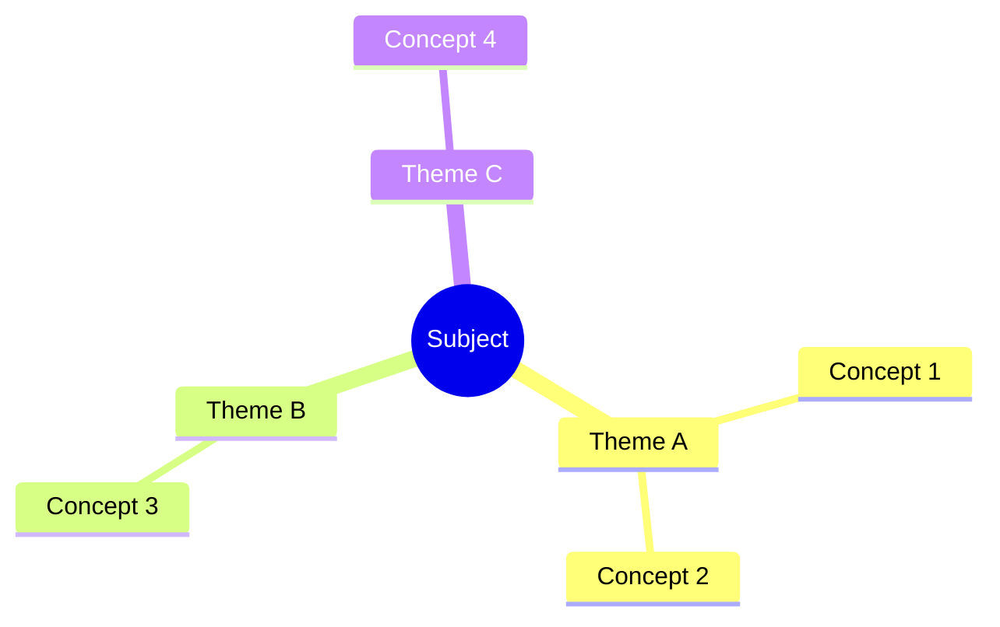

# 📚 [Subject Full Name] — MOC

> **How to use this template:** Duplicate this file, rename it to `[SUBJECT-CODE] - MOC.md` (e.g., `OOAD - MOC.md`), then change the `subject` field in the YAML above to match the subject code used in your lecture notes (e.g., `OOAD`). Replace `[Subject Full Name]` in the heading above. Everything below auto-populates as you add lecture notes — no editing required.

---

## 📖 All lectures

Auto-listed from any note where `subject` matches this MOC's subject.

```dataview
TABLE WITHOUT ID
  ("[[" + file.name + "]]") AS "Lecture",
  title AS "Topic",
  exam_weight AS "Weight",
  status AS "Status"
FROM ""
WHERE subject = this.subject AND type = "lecture-notes"
SORT lecture ASC
```

---

## 🔴 High-priority for exam

Only lectures flagged `exam_weight: high`.

```dataview
LIST title
FROM ""
WHERE subject = this.subject AND exam_weight = "high"
SORT lecture ASC
```

---

## 📊 Revision status

How far through revision you are. Use this to spot what's still in draft.

```dataview
TABLE WITHOUT ID
  status AS "Status",
  length(rows) AS "Count",
  rows.file.link AS "Lectures"
FROM ""
WHERE subject = this.subject AND type = "lecture-notes"
GROUP BY status
```

---

## 🧩 Concepts referenced across lectures

Concepts that appear in multiple lectures (= likely exam-important). Auto-built from wikilinks in your notes.

```dataview
TABLE WITHOUT ID
  out AS "Concept",
  length(rows) AS "Mentioned in"
FROM ""
WHERE subject = this.subject AND type = "lecture-notes"
FLATTEN file.outlinks AS out
WHERE !contains(meta(out).path, "MOC") AND !contains(string(out), "Lec ")
GROUP BY out
SORT length(rows) DESC
LIMIT 20
```

---

## 🧪 Tutorials & practice

Manually maintained — add as you go.

- [[SUBJECT-CODE Tutorial 01]]
- [[SUBJECT-CODE Past Paper 2024]]
- [[SUBJECT-CODE Past Paper 2025]]

---

## 🛠️ References

- **Textbook:** *(name + edition)*
- **Lecturer slides folder:** *(local path or link)*
- **External resources:** *(YouTube playlists, blog posts, etc.)*

---

## 🗺️ Mental model (optional)

Hand-drawn overview of how the subject's themes fit together. Update once mid-semester after you've seen the shape of the course.



---

*This MOC is the hub. Every lecture links back here via its footer. Open it before each revision session.*
